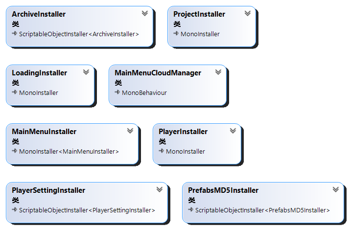

# 目录 
- [概述](#概述)
- [模块介绍](#模块介绍)
  - [Manager](#manager)
  - [Traffic Light](#traffic-light)
  - [UI](#ui)
  - [Logical](#logical)
  - [Other](#other)
- [配置文件](#配置文件)
- [总结](#总结)
# 概述
&nbsp;&nbsp;&nbsp;&nbsp;&nbsp;&nbsp;&nbsp;此项目使用的插件有新Input System、Cinemachine、Zenject、LitJson、AsyncAwaitUtil、UniRx及Edy’s Vehicle Physics 5，模型及音效均来自模型商店与互联网。 
&nbsp;&nbsp;&nbsp;&nbsp;&nbsp;&nbsp;&nbsp;存档与游戏设置的储存基于LitJson实现，使用了Aes算法进行简单加密，过程中通过`RandomNumberGenerator`产生的iv与key以二进制bin文件存储在计算机当前用户文件夹下，在游戏开始时通过文件系统读取加载入内存。 
&nbsp;&nbsp;&nbsp;&nbsp;&nbsp;&nbsp;&nbsp;使用了Async-Await异步编程替换掉协程，对于协程来说有更优的性能和更方便代码编写的好处。读取AssetBundle后使用配置文件中储存的MD5代替名字在资源中查找Asset，将被使用到的MD5通过`ScriptableObject`绑定到面板，使用时通过变量名调用，代码结构更清晰。
# 模块介绍
## Manager

	

 

&nbsp;&nbsp;&nbsp;&nbsp;&nbsp;&nbsp;&nbsp;管理器模块采用了Zenject中内存池的概念，使用可自定义的`IPoolable<T>`接口完成基类，搭配对应的管理器实现对资源的自动加载与卸载。其中`AudioManager`使用了中介者模式与门面模式设计，将`ClipManager`与`SourceManager`对外部类隐藏，同时降低对象之间的耦合性。

## Traffic Light

	

 

&nbsp;&nbsp;&nbsp;&nbsp;&nbsp;&nbsp;&nbsp;信号灯使用了两层状态机嵌套的模式来设计，第一层状态机`FSMTrafficLightManager`管理的是一个信号灯的状态的切换，例如红灯变绿灯等。第二层状态机`TrafficLightSystemManager`管理的是一个十字路口内所有信号灯的状态机，使用“MS、ML、SS和SL”后缀来决定哪一条街道哪个绿灯最先亮起，接着按顺序执行。最后由`TrafficLight`使用第二层状态机的Update与FixedUpdate方法，减少类与`MonoBehavior`之间的耦合。

## UI

	

 

&nbsp;&nbsp;&nbsp;&nbsp;&nbsp;&nbsp;&nbsp;UI模块采用中介者+部分MVC的形式编写，`UIManager`为中介，内部储存所有挂载`UIViewerBase`的游戏物体，通过`UIManager`的方法即可在一个View中访问另一个View的细节。`UIViewerBase`为View，例如`MainMenuArchive`为View，控制存档文件在界面的显示方式。而`ArchiveManager`充当了Controller和Model的角色，因为Model的内容只有存档所以将数据与业务逻辑集合在一起。

## Logical

	

 

&nbsp;&nbsp;&nbsp;&nbsp;&nbsp;&nbsp;&nbsp;`CloudManager`使用了内存池的思想，在云到了边界渐隐时重新分配位置然后渐显，避免频繁实例化导致的性能问题。至于玩家则采用了刚体组件来替代角色控制器组件以实现更好的物理效果，并且在脚本中模拟重力和速度而不是使用组件本身，但因为时间问题未对碰撞等问题进行优化。

## Other

	
  

 

&nbsp;&nbsp;&nbsp;&nbsp;&nbsp;&nbsp;&nbsp;此处是一些数据类，信号所需要的结构体，接口和枚举，最后就是Zenject在每个场景中绑定脚本的自定义安装器，不做过多介绍。

# 配置文件

	
	
	
	

 

&nbsp;&nbsp;&nbsp;&nbsp;&nbsp;&nbsp;&nbsp;配置文件由脚本自动化生成，在运行时由`JsonOperation`加载入内存然后分配，配置文件前缀为场景名，后缀为此场景需要在AssetBundle中读取到资产。文件包含资产名字，MD5，id等信息提供使用并验证。

# 总结
&nbsp;&nbsp;&nbsp;&nbsp;&nbsp;&nbsp;&nbsp;前面列举了很多优点，现在说一点缺点吧。对于场景没有做优化，运行时DrawCall过多导致GPU占用过高。对于资产打包只按照资产类型打包，而没有对具体需求分析后再对其打包，导致在打包Prefab时没有对Texture包建立依赖，而是在Prefab包里复制了另一份Texture副本，对空间和性能造成了额外的浪费。在使用Async-Await时，使用的AsyncAwaitUtil包应替换为UniTask以避免GC的产生，从而减轻CPU的负担。
